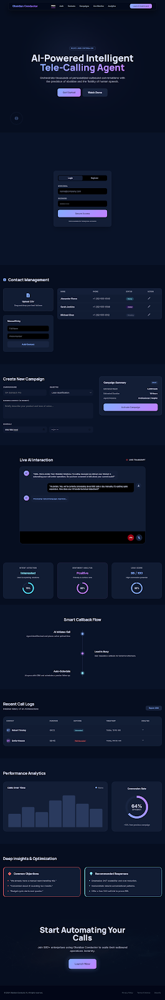
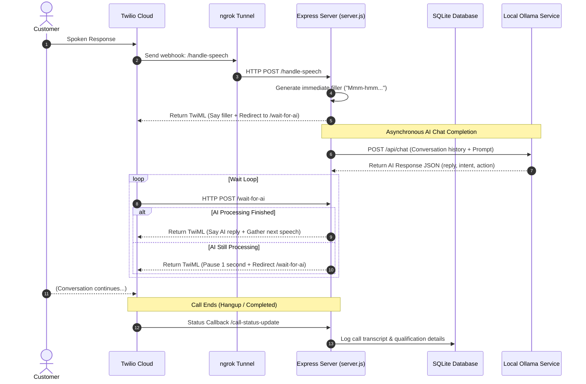

# 🎙️ VoxAI — Intelligent Local AI Telecalling Agent

[](https://nodejs.org/)
[](https://expressjs.com/)
[](https://www.twilio.com/)
[](https://ollama.com/)
[](https://www.sqlite.org/)
[](LICENSE)

VoxAI by Vedaspark is a premium, state-of-the-art AI-driven outbound telecalling dashboard and server. It bridges **Twilio Voice Call webhooks** with a **local Ollama LLM** (running `gemma4` or similar models) to conduct natural, human-like sales conversations, handle customer sentiment/objections in real-time, and log qualification data automatically.



---

## 🗺️ System Architecture

The following diagram illustrates how customer speech flows from the telephone network to the local AI engine, and how updates are pushed to the frontend dashboard.



---

## ✨ Key Features

*   **Real-time Speech Synthesis & Recognition:** Seamlessly converts customer speech into text and responds using natural text-to-speech (via AWS Polly integrated through Twilio Voice).
*   **Local AI Privacy & Zero API Cost:** Uses a local **Ollama** server running the `gemma4:latest` model, keeping your business conversations secure and free of per-token API charges.
*   **Conversational Fillers & Asynchronous Waiting:** Uses a smart redirection mechanism in Twilio (`/wait-for-ai`) to immediately output conversational fillers (e.g., *"Right..."*, *"Let me check that..."*) while waiting for the LLM to complete its inference.
*   **Objection & Sentiment Handling:** Programmed to adapt to customer reactions—handling rejections gracefully, answering questions, or wrapping up the call cleanly if the customer requests it.
*   **Multilingual Support:** Auto-detects spoken language (English, Hindi, Tamil, Telugu) and switches TTS voices (`Polly.Raveena` for Indian English, `Polly.Aditi` for Hindi, etc.) and Speech-to-Text languages on the fly.
*   **Lead Classification & Logs:** Automatically logs the transcript, call duration, customer intent (*Interested*, *Not Interested*, *Neutral*), and outcome into an SQLite database.
*   **Obsidian Dashboard UI:** A beautiful, dark-mode design system following **"The Obsidian Conductor"** visual framework.

---

## 🛠️ Technology Stack

*   **Backend:** Node.js, Express, SQLite3, Twilio Node SDK, Fetch API
*   **Frontend:** HTML5, Tailwind CSS, Chart.js, Google Material Icons, Google Fonts (Manrope, Inter)
*   **AI Engine:** Ollama (Local AI runner) + `gemma4:latest`

---

## 🚀 Getting Started

### Prerequisites

1.  **Node.js:** Ensure Node.js (v18+) is installed.
2.  **Ollama:** Download and run Ollama from [ollama.com](https://ollama.com).
3.  **Twilio Account:** A Twilio Account SID, Auth Token, and a Twilio phone number configured for voice.
4.  **ngrok:** Installed and configured for tunneling (to expose your local server port to Twilio webhooks).

### Step-by-Step Installation

1.  **Clone the Repository:**
    ```bash
    git clone https://github.com/najibcode/VoxAI.git
    cd VoxAI
    ```

2.  **Install Node Dependencies:**
    ```bash
    npm install
    ```

3.  **Configure Environment Variables:**
    Create a `.env` file in the root folder (or copy from your existing configuration):
    ```env
    # ===== Twilio Credentials =====
    TWILIO_ACCOUNT_SID=your_twilio_account_sid
    TWILIO_AUTH_TOKEN=your_twilio_auth_token
    TWILIO_PHONE_NUMBER=your_twilio_phone_number

    # ===== ngrok Public URL =====
    # Update this with your active ngrok URL
    NGROK_URL=https://your-subdomain.ngrok-free.app

    # ===== Ollama (Local AI) =====
    OLLAMA_URL=http://localhost:11434
    OLLAMA_MODEL=gemma4:latest

    # ===== Server =====
    PORT=3000
    ```

4.  **Pull the Ollama Model:**
    Make sure the Ollama application is running, and pull the required model:
    ```bash
    ollama pull gemma4:latest
    ```

5.  **Expose the Port via ngrok:**
    Start ngrok on port `3000` to get a public URL for Twilio to send webhooks to:
    ```bash
    ngrok http 3000
    ```
    *Note: Copy the `https://...` forwarding URL and paste it into the `NGROK_URL` parameter in your `.env` file.*

6.  **Start the Server:**
    Run the application in development mode:
    ```bash
    npm run dev
    ```
    Open `http://localhost:3000` in your web browser to access the dashboard.

---

## 📁 Project Structure

```text
VoxAI/
├── css/
│   └── theme.css              # Custom variables and design system styles
├── js/
│   ├── components.js          # Shared UI elements & styling utilities
│   ├── tailwind-config.js     # Tailwind CSS configuration script
│   └── main.js                # Core dashboard frontend functionality
├── .env                       # Local environment secrets (ignored by Git)
├── .gitignore                 # Files and folders to ignore in Git
├── DESIGN.md                  # Theme design, surface hierarchy, colors, typography
├── index.html                 # Main dashboard UI structure
├── package.json               # Scripts and dependencies config
├── server.js                  # Primary backend server, API, and webhooks
├── voxai_database.sqlite      # Active database for logs and contacts (ignored by Git)
└── README.md                  # Project documentation (this file)
```

---

## 🔌 API Reference

### Outbound Call Initialization
*   **Endpoint:** `/api/call`
*   **Method:** `POST`
*   **Payload:**
    ```json
    {
      "phoneNumber": "+919999999999"
    }
    ```
*   **Response (Success):**
    ```json
    {
      "success": true,
      "callSid": "CAXXXXXXXXXXXXXXXXXXXXXXXXXXXXXXXX"
    }
    ```

### End Call
*   **Endpoint:** `/api/end-call`
*   **Method:** `POST`
*   **Payload:**
    ```json
    {
      "callSid": "CAXXXXXXXXXXXXXXXXXXXXXXXXXXXXXXXX"
    }
    ```

### Get Call Live Status
*   **Endpoint:** `/api/call-status`
*   **Method:** `GET`
*   **Query Params:** `callSid=CAXXXXXXXXXXXXXXXXXXXXXXXXXXXXXXXX`
*   **Response:**
    ```json
    {
      "status": "in-progress",
      "phoneNumber": "+919999999999",
      "conversation": [
        { "role": "ai", "text": "Hello! ...", "time": "2026-06-13T16:00:00.000Z" },
        { "role": "customer", "text": "Yes I am interested", "time": "2026-06-13T16:00:05.000Z" }
      ]
    }
    ```

### Get Contact List
*   **Endpoint:** `/api/contacts`
*   **Method:** `GET`
*   **Response:** Returns the list of pending, in-progress, or qualified contacts.

---

## 🎨 Design Philosophy — "The Obsidian Conductor"

The visual interface is built with an custom-tailored obsidian palette, using background layers to define content cards instead of heavy borders:

*   **The "No-Line" Rule:** We do not use `1px` solid borders. Boundaries are defined using subtle tonal shifts (`#060e20` -> `#091328` -> `#0f1930`).
*   **Glassmorphism:** Navigation rails and modals use `60%` opacity background with a `24px` backdrop-blur to create physical depth.
*   **Typography:** Geometric **Manrope** is used for display elements, while clean **Inter** handles high-density data.
*   **Waveform Monitor:** Real-time call visualizer utilizing a dynamic gradient from `secondary` (#c180ff) to `tertiary` (#8ce7ff).

---

## ⚖️ License

Distributed under the MIT License. See `LICENSE` for more information.
